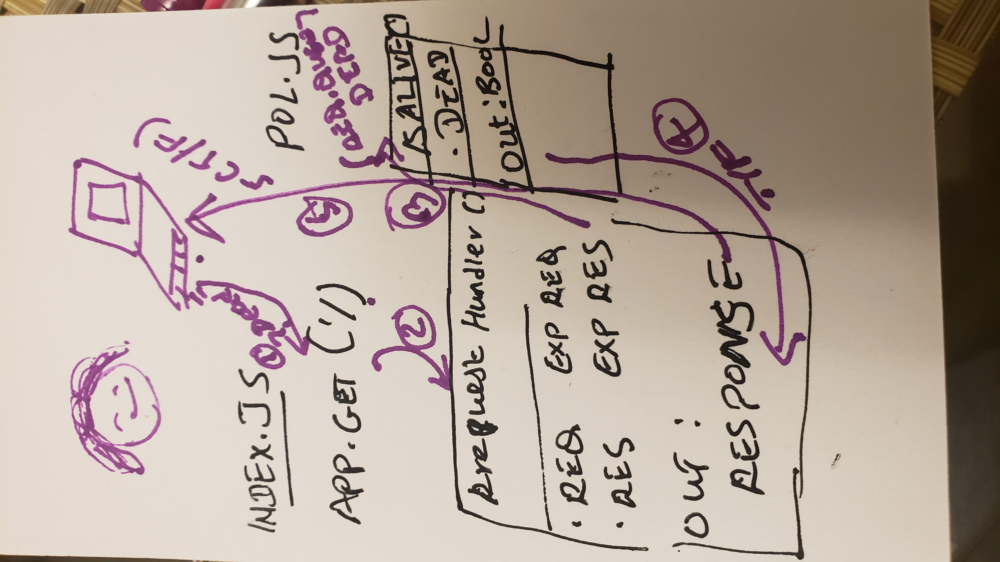

# LAB -00

## Proof of Life server

### Author: Meron 

### Links and Resources
* [submission PR](https://github.com/meron-401n14/lab-00/pull/1)
* [travis](https://travis-ci.com/meron-401n14/lab-00)
* [front-end](https://meron-lab-00.herokuapp.com/) 

#### Documentation
* [jsdoc](https://meron-lab-00.herokuapp.com/docs/) 

### Modules
#### pos.js

##### Exported Values and Methods

###### `isAlive(dead)-> boolean`
Return true/false to indicate how the server works

### Setup
#### `.env` requirements
* `PORT` - Port Number

#### Running the app
* `npm start`
* Endpoint: `/`
  * Returns a boolean.
* Endpoint: `/docs`
  * Returns a JSDoc Documentaion Pages.
  
#### Tests
* Unit Tests: `npm test`
* Lint Tests: `npm run lint`

#### UML

